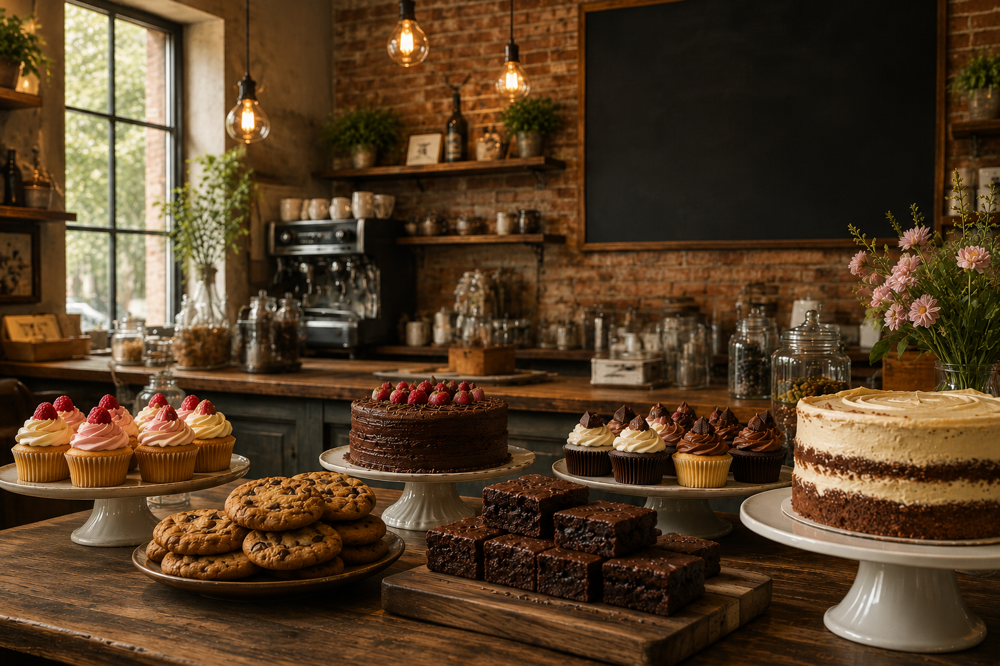

# 🧁 Cakery

A modern bakery website built with React, featuring a product catalog, shopping cart functionality, custom cake offerings, and responsive design.



## ✨ Features

* Browse a selection of cupcakes, cookies, pies, brownies, and custom cakes
* Filter products by category
* Add products to a shopping cart
* Remove items from the cart
* Automatic order total calculation
* Order confirmation popup
* Custom Cakes section
* Order Online section with Pickup, Delivery, and Events options
* Contact form
* Responsive design for desktop, tablet, and mobile devices
* Custom favicon and bakery-themed styling

---

## 🛠️ Built With

* React
* JavaScript (ES6+)
* CSS3
* Vite

---

## 📂 Project Structure

```text
src/
├── components/
│   ├── Header.jsx
│   ├── Hero.jsx
│   ├── About.jsx
│   ├── ProductCard.jsx
│   ├── ProductGrid.jsx
│   ├── Cart.jsx
│   ├── CustomCakeGrid.jsx
│   ├── OrderOnline.jsx
│   ├── ContactForm.jsx
│   ├── Popup.jsx
│   └── Footer.jsx
│
├── data/
│   └── products.js
│
├── App.jsx
├── App.css
├── main.jsx
└── index.css
```

---

## 🚀 Getting Started

### Clone the repository

```bash
git clone https://github.com/yourusername/cakery.git
```

### Navigate to the project

```bash
cd cakery
```

### Install dependencies

```bash
npm install
```

### Start the development server

```bash
npm run dev
```

Open your browser and navigate to:

```text
http://localhost:5173
```

---

## 🎨 Design Goals

The goal of Cakery was to create a warm and inviting bakery experience with:

* Soft bakery-inspired color palette
* Elegant typography using Playfair Display and Nunito
* High-quality product photography
* Clean and responsive layout
* Simple and intuitive user experience

---

## 📚 What I Learned

During this project I practiced:

* React Components
* Props
* State Management with useState
* Conditional Rendering
* Event Handling
* Array Methods (map, filter, reduce)
* Component-based Architecture
* Responsive Design
* CSS Grid and Flexbox
* Project Organization

---

## 🔮 Future Improvements

* Product quantity controls in cart
* Custom Cake Builder
* Persist cart with localStorage
* Search functionality
* React Router navigation
* Backend integration for orders
* Online payment support

---

## 👩‍💻 Author

**Anette Söderström**

Software Tester transitioning into Frontend Development.

GitHub: https://github.com/yourusername

---

## 📄 License

This project was created for educational and portfolio purposes.
